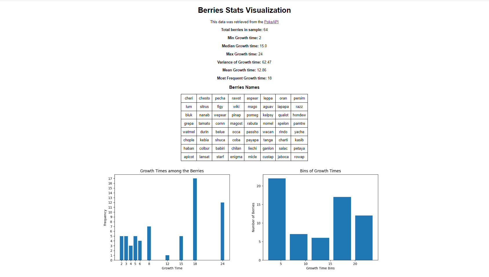

# Pokeberries Statistics API

Simple API developed in [Django](https://www.djangoproject.com/) that retrieves data related to pokeberries and performs statistical calculations on them, using the [Poke API](https://pokeapi.co/docs/v2#berries).

## Deployment
This app is deployed using [Python Anywhere](https://pythonanywhere.com/). You can see it [here](https://ignaciofrizzera.pythonanywhere.com/)

## Setup

### Option 1: Setup with Docker
1) Install [Docker](https://www.docker.com/) if you don't have it installed

2) Clone the repository
    ```
    git clone https://github.com/ignaciofrizzera/pokeberries-statistics-api.git
    ```

3)  Go inside the repository, into the **pokeberries-statistics-api** folder

4) Create a **.env** file, following the [**.env.example**](.env.example) file structure. There are two variables set (you can always add more if needed):
    * **DEBUG**: whether to turn [DEBUG](https://docs.djangoproject.com/en/5.1/ref/settings/#std-setting-DEBUG) on or off. This should be set to True during local development, and False on production enviroments.
    * **SECRET_KEY**: the [SECRET_KEY](https://docs.djangoproject.com/en/5.1/ref/settings/#secret-key) auto-generated by Django. To generate your own key, you should run this command (use Git Bash or Powershell if you're on Windows systems):
        
        ```bash
        docker run --rm -it --entrypoint "" $(docker build -q .) python -c "from django.core.management.utils import get_random_secret_key; print(get_random_secret_key())"
        ```
        Copy the generated **SECRET_KEY** into your .env file.
5) Build the Docker image:
    ```
    docker build -t pokeberries-api .
    ```
6) Run the Docker container:
    ```
    docker run -p 8000:8000 pokeberries-api
    ``` 
7) Finally, the app should be running on http://localhost:8000/

### Option 2: Setup without Docker
1) Install [Python](https://www.python.org/downloads/) if you don't have it installed

2) Clone the repository
    ```
    git clone https://github.com/ignaciofrizzera/pokeberries-statistics-api.git
    ```

3) Go inside the repository, into the **pokeberries-statistics-api** folder

4) Set up a virtual enviroment using the tool of your choice. Some options are [conda](https://anaconda.org/anaconda/conda) or [virtualenv](https://virtualenv.pypa.io/en/latest/)

5) Install the requirements. This can be done by running the following command:
   ```bash
   pip install -r requirements.txt
   ```

6) Create a **.env** file, following the [**.env.example**](.env.example) file structure. There are two variables set (you can always add more if needed):
    * **DEBUG**: whether to turn [DEBUG](https://docs.djangoproject.com/en/5.1/ref/settings/#std-setting-DEBUG) on or off. This should be set to True during local development, and False on production enviroments.
    * **SECRET_KEY**: the [SECRET_KEY](https://docs.djangoproject.com/en/5.1/ref/settings/#secret-key) auto-generated by Django. To generate your own key, you should run this command:
        
        ```bash
        python -c "from django.core.management.utils import get_random_secret_key; print(get_random_secret_key())"
        ```
        Copy the generated **SECRET_KEY** into your .env file.

7) Run the app
   ```bash
   python manage.py runserver
   ```

8) Finally, the app should be running on http://localhost:8000/

## API Endpoints

The API consists of one simple endpoint **/allBerryStats**.

### allBerryStats [GET]
This endpoint only allows the **GET** method, and fetches data from the Poke API, specifically the [berries endpoint](https://pokeapi.co/docs/v2#berries-section), and performs statistical calculations with the **growth_time** property. As the Poke API documentation states, the **growth time** is:
> Time it takes the tree to grow one stage, in hours. Berry trees go through four of these growth stages before they can be picked.

The response looks like this:

```json
{
    "berries_names": [
        "cheri",
        "chesto",
        "pecha",
        "..."
    ],
    "min_growth_time": 2,
    "median_growth_time": 15.0,
    "max_growth_time": 24,
    "variance_growth_time": 62.47,
    "mean_growth_time": 12.86,
    "frequency_growth_time": 18
}
```

* **berries_names** is a list containing all the names of the pokeberries retrieved.
* **min_growth_time** is an integer with the minium growth time among all retrieved pokeberries.
* **median_growth_time** is a float with the median of the growth time for all retrieved pokeberries.
* **max_growth_time** is an integer with the maxium growth time among all retrieved pokeberries.
* **variance_growth_time** is a float with the variance of the growth time for all retrieved pokeberries.
* **mean_growth_time** is a float with the mean of the growth time for all retrieved pokeberries.
* **frequency_growth_time** is an integer representing the most frequent growth time among all retrieved pokeberries.

In case of any error or failure, you'll get an error message in the response that looks like this:

```json
{
    "error": 'There was an error processing the berry statistics.'
}
```

## Visualization
If you wish to visualize the data of the berries, you can go to the main page of the application (e.g., by navigating to **localhost:8000** in your browser) to see the berry statistics visualized. The page should look like this:




## Testing

The test cases for this project are located in the `tests` directory. You can view the test file [here](./tests/tests_berries.py).

To run them use the following command:
```bash
python manage.py test
```
